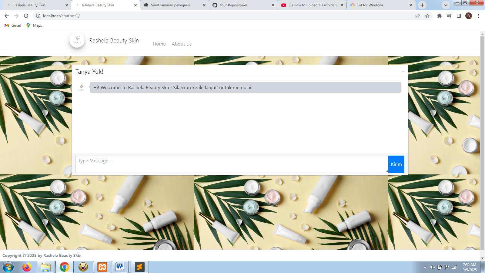

📄 README – Chatbot Skincare

📌 Skincare Chatbot System

A web-based chatbot simulation that recommends skincare products based on skin type and product categories. Includes **frontend for users** and **backend for admin** (currently backend login has a bug).

---

🚀 Features

🛠️ Frontend (User)

* Homepage → chatbot-style Q\&A for skincare recommendations
* About page → usage guide & about us information

🛠️ Backend (Admin)

* Login & logout system (⚠️ currently error, needs fixing)
* Dashboard overview
* Manage skincare product brands (CRUD)
* Manage skincare product types (CRUD)
* Manage products by brand & type (CRUD)

  * Includes product name, skin type suitability, price, description, benefits, usage guide

---

🛠️ Tech Stack

* **Programming Language**: PHP, HTML, CSS
* **Framework/Library**: Native PHP + Bootstrap
* **Database**: MySQL
* **Tools**: XAMPP (Apache, PHP, MySQL), phpMyAdmin, Sublime Text

---

📂 Project Structure

```plaintext
/chatbot-skincare
 ┣ 📂 build         # css, js, images
 ┣ 📂 ckeditor      
 ┣ 📂 admin         # dashboard, CRUD (login currently error)
 ┣ 📂 classes
 ┣ 📂 database
   ┗ 📜 chatbot_db.sql  # SQL file to import database
 ┣ 📂 dist
 ┣ 📂 inc
 ┣ 📂 libs
 ┣ 📂 plugins
 ┣ 📂 uploads
 ┣ 📜 index.php     # chatbot homepage
 ┣ 📜 initialize.php
 ┣ 📜 portal.php
 ┣ 📜 README.md
```

---

⚙️ Installation & Usage

1. Clone the repository

   ```bash
   git clone https://github.com/rahma309/Chatbot-Skincare.git
   ```
2. Move project to XAMPP `htdocs` folder

   ```
   C:\xampp\htdocs\chatbot1
   ```
3. Import database

   * Open phpMyAdmin → Create new DB `chatbot_db`
   * Import `chatbot_db.sql`
4. Run project

   * Start Apache & MySQL in XAMPP
   * Open browser:

     * User view → [http://localhost/chatbot1](http://localhost/chatbot1)
     * Admin view → [http://localhost/chatbot1/admin](http://localhost/chatbot1/admin)

---

📸 Screenshots




---

📈 Future Improvements

* Fix admin login bug
* Enhance chatbot logic (more interactive Q\&A)
* Add search & filter by skin type
* Improve UI with animations

---

💻 Author

**Rahma Eka Putri**

* 📧 Email: [rahmaputri552@gmail.com](mailto:rahmaputri552@gmail.com)
* 🌐 GitHub: [github.com/rahmaputri309](https://github.com/rahmaputri552)

---
